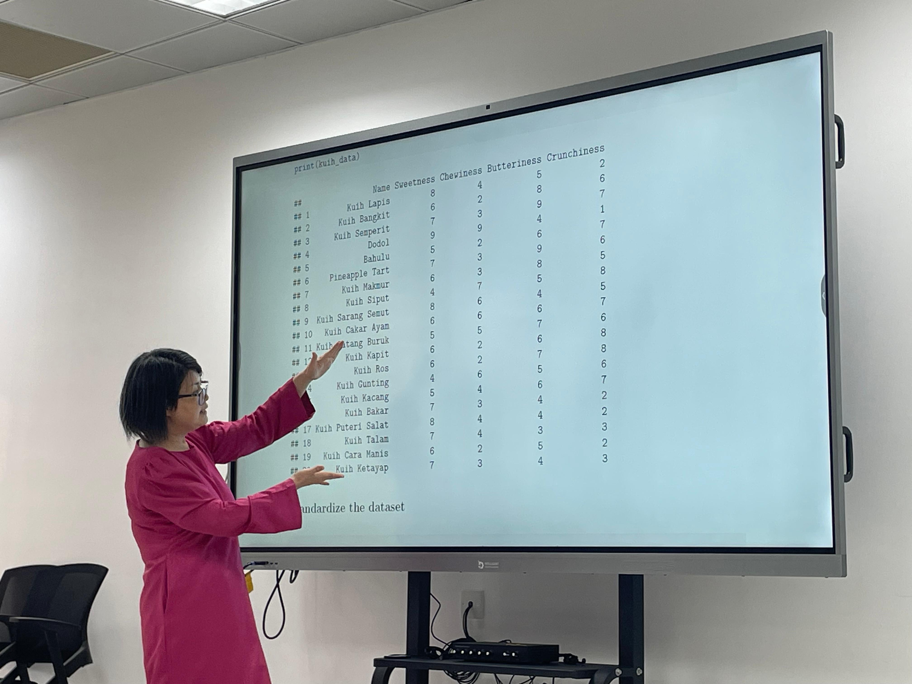

It’s the time of the year, Hari Raya Aidilfiti, a season filled with joy, unity and gratitude. To celebrate, the [Brunei R User Group](https://bruneir.github.io) (BRUG) hosted the signature event, R\>aya Meetup on 18th April 2025 at Ruang Bicara Minda, UBD Library. This marks the second time of hosting such annual gathering that blends the festive spirit of Hari Raya Aidilfitri with our shared passion for R programming.

The event kicked off at 2:00 PM with a warm welcome, an overview of BRUG, its mission, and the day’s agenda, presented by the Chair, Dr. Haziq Jamil. This was followed by a series of exciting talks from our three guest speakers: Dr Daphne Lai, Muaz Mahdi and Hafeezul Waeezz Rabu.

Dr Daphne opened the session with an insightful demonstration on Principal Component Analysis (PCA), using R to cluster different types of ‘kuih raya’ (Raya desserts) based on characteristics like sweetness, chewiness, butteriness, and crunchiness. A perfect blend of data science and dessert that left us hungry for more!

Next, Muaz brought the fun with a creative use of Markov Chains to explore the best eating strategy for feeling fully satisfied during a Raya open house. From setting up a "tummy state" matrix (ranging from very hungry to overstuffed) to visualizing different eating strategies, it was a thoughtful and humorous take on making the most of our festive feasts.

Lastly, Hafeezul wrapped up the speaker series with a dive into APIs, analyzing Hari Raya songs on YouTube. From most-viewed to most-liked videos, the session even included linear regressions to explore trends. And yes, it turns out the most viewed Hari Raya song for 2025 on Youtube is [Meriah Lain Macam](https://youtu.be/0VM-5VM__5U?si=P88B4bR7z7DG_zrl) !

After a lively Q&A session at 3:45 PM, the event wrapped up with open-floor networking, light refreshments, and of course, an abundance of kuih raya. It was a great opportunity to connect, share, and celebrate, with tech and tradition in harmony.

A big thank you to everyone who joined us! We’re grateful for the support and enthusiasm of the BRUG community. Until next time, Selamat Hari Raya Aidilfitri, and stay tuned for more exciting events ahead!

 

***Happy Coding,***

*The Brunei R User Group.*
